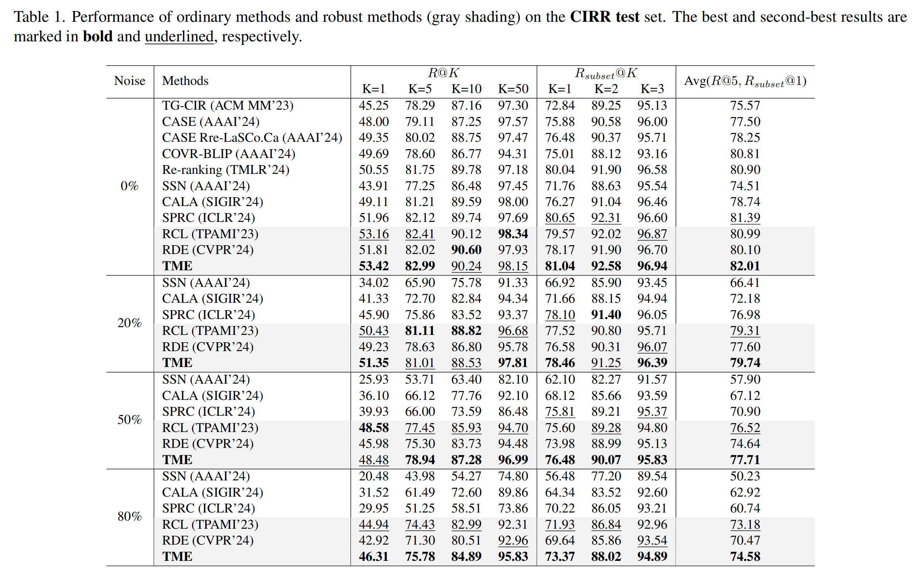
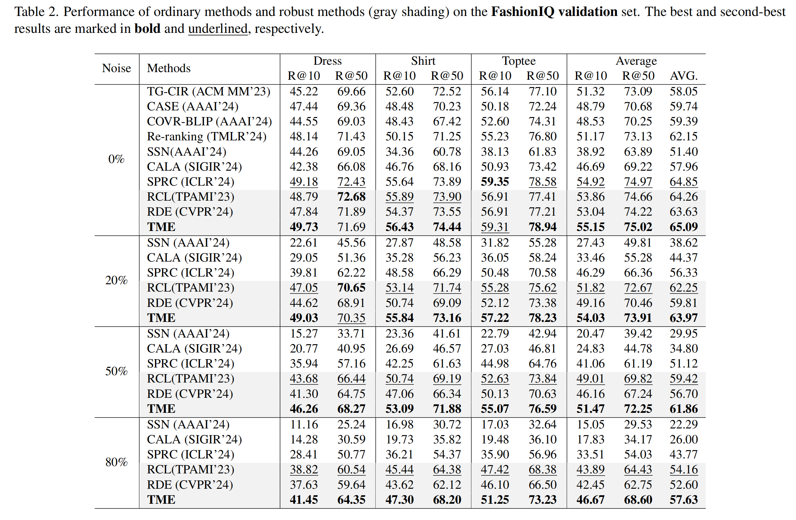

# 2025-CVPR-TME

[[CVPR 2025](https://cvpr.thecvf.com/)] Code for the paper "[Learning with Noisy Triplet Correspondence for Composed Image Retrieval](2025-CVPR-TME/TME.pdf)"


## Preparation

### Project structure

The proper project structure for running the code is as follows:

~~~
TME/
├── bert-base-uncased/
├── data/
│   ├── CIRR/
│   │   ├── captions/
│   │   │   ├── captions/
│   │   │   │   │ cap.rc2.test1.json
│   │   │   │   │ cap.rc2.train.json
│   │   │   │   │ cap.rc2.val.json
│   │   │   ├── image_splits/
│   │   │   │   │ split.rc2.test1.json
│   │   │   │   │ split.rc2.train.json
│   │   │   │   │ split.rc2.val.json
│   │   ├── dev/
│   │   │   │ dev-0-0-img0.png
│   │   │   │ ...
│   │   ├── test1/
│   │   │   │ test1-0-0-img0.png
│   │   │   │ ...
│   │   ├── train/
│   │   │   ├── 0/
│   │   │   ├── 1/
│   │   │   ├── ...
│   ├── FashionIQ/
│   │   ├── captions
│   │   │   │ cap.dress.train.json
│   │   │   │ cap.dress.val.json
│   │   │   │ ...
│   │   ├── image_splits
│   │   │   │ split.dress.train.json
│   │   │   │ split.dress.val.json
│   │   │   │ ...
│   │   ├── images
│   │   │   │ B00006M009.jpg
│   │   │   │ B00006M00B.jpg
│   │   │   │ ...
├── src/
│   │ ...
├── weight/
│   │ blip2_pretrained.pth
│   │ eva_vit_g.pth
~~~

### Prerequisites

The following commands will create a local Anaconda environment with the necessary packages installed. We provide all package versions, but using the exact same versions is not necessary to run the code; any version shall be fine. Note that Using MKL versions 2024.1+ with PyTorch may result in an "ImportError: undefined symbol: iJIT_NotifyEvent".

~~~l
conda create -n TME -y python=3.10
conda activate TME
conda install pytorch==2.1.2 torchvision==0.16.2 torchaudio==2.1.2 pytorch-cuda=12.1 -c pytorch -c nvidia
pip install -r requirements.txt
~~~

### dataset setting
Please modify `FashioniqPath` and `CIRRPath` in `data.py` to point to your dataset paths. Also, check the folder names in `data.py` to ensure they match the names of your dataset folders. The default dataset settings are as follows:

~~~
# data.py:
FashioniqPath = './data/FashionIQ/' # end with '/'
CIRRPath = './data/CIRR/' # end with '/'
~~~

### Pretrained wegiht

Download the BLIP2 weights and place them in the `weight` directory. 
- `blip2_pretrained.pth`: 'https://storage.googleapis.com/sfr-vision-language-research/LAVIS/models/BLIP2/blip2_pretrained.pth' 
- `eva_vit_g.pth`: 'https://storage.googleapis.com/sfr-vision-language-research/LAVIS/models/BLIP2/eva_vit_g.pth'

 To use the online url during training, simply edit the following file: `src/lavis/models/blip2_models/blip2.py line 85-98` and `src/lavis/models/eva_vit.py line 428-447`.

## Runing

### Precompute

Encodings via Frozen ViT remain unchanged during training. To save time, we precompute the ViT encodings using `precompute.py`, which creates a `features` directory containing the precomputed features inside the project directory `TME`.

~~~
python src/precompute.py \
    --dataset {'CIRR' or 'FashionIQ'} \
    --split {'test1', 'train' or 'val'} \
    --batch_size 512
~~~

Storing features requires a lot of space. If your storage is insufficient, you can call `compute_vit_features()` in `precompute.py` to generate the features (as a CPU tensor) and the name_to_idx dictionary. Then, replace `load_image_features()` with `load_image_features_tensor_and_dict()` in `precompute_train.py` and `precompute_test.py` to avoid loading features from local disk storage.


### Training 
~~~
python src/precompute_train.py \
    --exp_name {your_exp_name} \
    --shuffle_seed 42 \
    --seed 42 \
    --dataset {'CIRR' or FashionIQ} \
    --noise_ratio 0.0 \
    --nc_type "mix" \
    --batch_size 128 \
    --num_epochs 30 \
    --warmup_qformer 3 \
    --warmup_proj 2 \
    --warmup_last 1 \
    --partitioner "GMM" \
    --split_type "loss" \
    --threshold 0.5 \
    --lr "1e-5" \
    --lpm 1.0 \
    --lsa 1.0 \
    --lrd {'0.2' for CIRR and '0.1' for FashionIQ} \
    --save_training \
    --gpu {gpu_default_0}
~~~

### Test or Evaluation

Note that the test mode is only for CIRR.

~~~
python src/precompute_test.py \
    --dataset {CIRR or FashionIQ} \
    --mode {validate or test} \
    --model-path {your_model_path} \
    --gpu {gpu_default_0} \
    --name {save_folder_name}
~~~

### Checkpoints

We provide the best TME model weight for CIRR and FashionIQ in the setting without sythetic noise in kaggle.

Weights: [CIRR](https://www.kaggle.com/models/charlesneilsucian/tme/pyTorch/cirr-0.0-best), [FashionIQ](https://www.kaggle.com/models/charlesneilsucian/tme/pyTorch/fashioniq-0.0-best).


## Experiment Results

### CIRR performance:



### FashionIQ performance:




## Citation

If you find our work useful in your research, please consider citing:

```bibtex
@inproceedings{TME,
  title={Learning with Noisy Triplet correspondence for Compose Image Retrieval},
  author={Li, Shuxian and He, Changhao and Liu, Xiting and Zhou, Joey Tianyi and Peng, Xi and Hu, Peng},
  booktitle={IEEE International Conference on Computer Vision and Pattern Recognition (CVPR)},
  year={2025},
}
```

## Acknowledgement

Our implementation is based on [CLIP4Cir](https://github.com/ABaldrati/CLIP4Cir) and [LAVIS](https://github.com/salesforce/LAVIS).
